# CI/CD Pipeline Documentation

This document explains how the GitHub Actions CI/CD pipeline works for the Molecular Dynamics Simulation project.

## Overview

The pipeline automates building, testing, deploying, and releasing the application. It's defined in `.github/workflows/deploy.yml`.

## Pipeline Architecture

```mermaid
flowchart TB
    subgraph Triggers["🎯 Triggers"]
        A[Push to main] 
        B[Pull Request to main]
        C[Push Tag v*]
    end

    subgraph Jobs["⚙️ Jobs"]
        D[build-and-test]
        E[deploy]
        F[release]
    end

    subgraph Outputs["📦 Outputs"]
        G[GitHub Pages]
        H[GitHub Release]
    end

    A --> D
    B --> D
    C --> D
    
    D -->|"main branch push"| E
    D -->|"version tag"| F
    
    E --> G
    F --> H
```



## Trigger Events

| Event | Branch/Tag | Actions Performed |
|-------|------------|-------------------|
| `push` | `main` | Build → Test → Deploy to GitHub Pages |
| `pull_request` | `main` | Build → Test (no deployment) |
| `push` | `v*` tags | Build → Test → Create GitHub Release |

## Job Details

### 1. Build and Test Job (`build-and-test`)

This job runs on every trigger and performs the core build/test operations.

```mermaid
flowchart LR
    subgraph build-and-test["🔨 build-and-test Job"]
        direction TB
        A[Checkout Code] --> B[Setup Node.js 20]
        B --> C[Install Dependencies<br/>npm ci]
        C --> D[Run Tests<br/>npm run test:coverage]
        D --> E[Generate JSDoc<br/>npm run docs]
        E --> F[Build Production<br/>npm run build]
        F --> G[Copy docs & coverage<br/>to dist/]
        G --> H[Upload Artifacts]
    end
```



**Steps Explained:**

| Step | Command | Purpose |
|------|---------|---------|
| Checkout | `actions/checkout@v4` | Clone repository |
| Setup Node | `actions/setup-node@v4` | Install Node.js 20 with npm cache |
| Install | `npm ci` | Clean install dependencies |
| Test | `npm run test:coverage` | Run 367 tests with coverage report |
| Docs | `npm run docs` | Generate JSDoc API documentation |
| Build | `npm run build` | Create production bundle in `dist/` |
| Copy | `cp -r docs dist/` | Include docs & coverage in deployment |
| Upload | `actions/upload-pages-artifact@v3` | Store artifacts for deployment |

### 2. Deploy Job (`deploy`)

Deploys the application to GitHub Pages. Only runs on `main` branch pushes.

```mermaid
flowchart LR
    subgraph deploy["🚀 deploy Job"]
        direction TB
        A[Wait for build-and-test] --> B{Is main branch?}
        B -->|Yes| C[Deploy to GitHub Pages]
        B -->|No| D[Skip]
        C --> E[Live at<br/>aryaghan-mutum.github.io/MolecularDynamics]
    end
```



**Condition:** `github.ref == 'refs/heads/main' && github.event_name == 'push'`

**Deployed URLs:**
- 🌐 **App:** https://aryaghan-mutum.github.io/MolecularDynamics/
- 📖 **Docs:** https://aryaghan-mutum.github.io/MolecularDynamics/docs/
- 📊 **Coverage:** https://aryaghan-mutum.github.io/MolecularDynamics/coverage/

### 3. Release Job (`release`)

Creates a GitHub Release when a version tag is pushed.

```mermaid
flowchart LR
    subgraph release["📦 release Job"]
        direction TB
        A[Wait for build-and-test] --> B{Is v* tag?}
        B -->|Yes| C[Checkout with history]
        B -->|No| D[Skip]
        C --> E[Build Production]
        E --> F[Create ZIP archive]
        F --> G[Generate Changelog]
        G --> H[Create GitHub Release]
        H --> I[Upload ZIP as asset]
    end
```



**Condition:** `startsWith(github.ref, 'refs/tags/v')`

**Release Features:**
- 📝 Auto-generated changelog from commits
- 📦 Downloadable ZIP of production build
- 🏷️ Prerelease detection for `-alpha`, `-beta`, `-rc` tags

## Complete Pipeline Flow

```mermaid
sequenceDiagram
    participant Dev as Developer
    participant GH as GitHub
    participant Actions as GitHub Actions
    participant Pages as GitHub Pages

    Note over Dev,Pages: Scenario 1: Pull Request
    Dev->>GH: Create PR to main
    GH->>Actions: Trigger workflow
    Actions->>Actions: build-and-test
    Actions->>GH: Report status ✅/❌

    Note over Dev,Pages: Scenario 2: Merge to main
    Dev->>GH: Merge PR to main
    GH->>Actions: Trigger workflow
    Actions->>Actions: build-and-test
    Actions->>Actions: deploy
    Actions->>Pages: Deploy app, docs, coverage
    Pages->>Dev: Live site updated 🚀

    Note over Dev,Pages: Scenario 3: Create Release
    Dev->>GH: Push tag v1.1.0
    GH->>Actions: Trigger workflow
    Actions->>Actions: build-and-test
    Actions->>Actions: release
    Actions->>GH: Create Release with ZIP 📦
```



## How to Create a Release

### Step 1: Ensure version is updated in `package.json`

```json
{
  "version": "1.1.0"
}
```

### Step 2: Merge all changes to main

```bash
git checkout main
git pull origin main
```

### Step 3: Create and push a version tag

```bash
# Create tag
git tag v1.1.0

# Push tag to trigger release
git push origin v1.1.0
```

### Step 4: Monitor the release

Go to [Actions](https://github.com/aryaghan-mutum/MolecularDynamics/actions) to watch the pipeline.

Once complete, find your release at [Releases](https://github.com/aryaghan-mutum/MolecularDynamics/releases).

## Tag Naming Convention

| Tag Format | Release Type | Example |
|------------|--------------|---------|
| `vX.Y.Z` | Stable Release | `v1.0.0`, `v2.1.0` |
| `vX.Y.Z-alpha` | Alpha Prerelease | `v1.1.0-alpha` |
| `vX.Y.Z-beta` | Beta Prerelease | `v1.1.0-beta` |
| `vX.Y.Z-rc.N` | Release Candidate | `v1.1.0-rc.1` |

## Permissions

The pipeline requires these GitHub token permissions:

```yaml
permissions:
  contents: write    # Create releases
  pages: write       # Deploy to Pages
  id-token: write    # OIDC token for Pages
```

## Concurrency Control

```yaml
concurrency:
  group: "pages"
  cancel-in-progress: true
```

This ensures only one deployment runs at a time, canceling any in-progress deployment when a new one starts.

## Environment Variables

| Variable | Value | Purpose |
|----------|-------|---------|
| `CI` | `true` | Indicates CI environment for tests |
| `NODE_ENV` | `production` | Production build optimization |
| `PUBLIC_URL` | `/MolecularDynamics` | Base path for GitHub Pages |

## Troubleshooting

### Tests Failing
- Check test output in Actions logs
- Run locally: `npm run test:coverage`

### Deployment Not Triggering
- Ensure pushing to `main` branch
- Check if PR was merged (not just closed)

### Release Not Created
- Ensure tag starts with `v` (e.g., `v1.0.0`)
- Check if tag was pushed: `git push origin v1.0.0`

### Coverage/Docs Not Updating
- Verify JSDoc generates: `npm run docs`
- Check `dist/` folder structure after build

## File Structure After Build

```
dist/
├── index.html
├── bundle.js
├── bundle.js.map
├── styles.css
├── docs/           # JSDoc API documentation
│   ├── index.html
│   └── ...
└── coverage/       # Test coverage report
    ├── index.html
    └── ...
```
